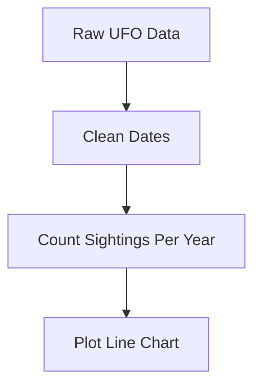
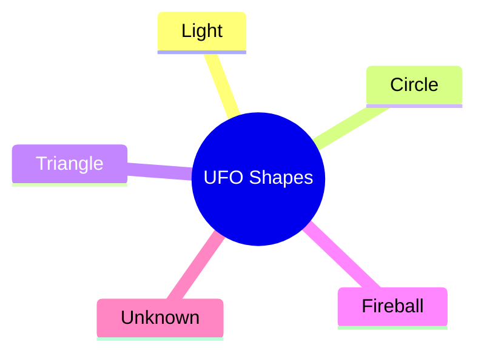

# 🛸 **UFO Sightings Analysis**

This project is all about studying UFO sightings from many years.
We take real data, clean it, understand it, and show amazing charts.
Easy to read, easy to understand, and perfect for learning data analysis.

---

## ⭐ **Project Summary**

This project explores two datasets of UFO sightings:

* **complete.csv** → Big full dataset
* **scrubbed.csv** → Clean and filtered dataset

We turn this raw data into:

* Clean tables
* Trend charts
* Hotspot maps
* Word clouds
* Insights people can understand easily

---

## 🔧 **What This Project Does**

### ✔️ Cleans the Data

* Fix date and time
* Fix shapes (circle, light, triangle, etc.)
* Add missing country names
* Skip wrong lines
* Make everything neat

### ✔️ Does EDA (Exploratory Data Analysis)

* Yearly trends
* Top UFO shapes
* Word usage in comments
* Map of sightings
* Duration patterns

### ✔️ Makes Beautiful Visuals

* Line charts
* Bar graphs
* Boxplots
* Folium map
* WordCloud

Everything kept simple and clean.

---

## 🗂️ **Dataset Columns**

| Column             | Meaning                      |
| ------------------ | ---------------------------- |
| datetime           | When the UFO was seen        |
| city               | Which city                   |
| state              | State/region                 |
| country            | Country code                 |
| shape              | Shape of UFO                 |
| duration (seconds) | How long the sighting lasted |
| comments           | What the person wrote        |
| date posted        | When the report was posted   |
| latitude           | GPS latitude                 |
| longitude          | GPS longitude                |

Easy and clear.

---

## 🧠 **Tech Used**

* Python
* pandas
* seaborn
* matplotlib
* folium
* wordcloud
* Jupyter Notebook

Straightforward tools for data analysis.

---


### ⭐ Yearly Sighting Trend (Concept Flow)



### ⭐ UFO Analysis Pipeline


### ⭐ Shape Distribution Mindmap



---

## 🌍 **Geospatial Map**

A Folium map is created:

📌 **ufo_hotspots.html**

Shows first **200 UFO sightings** on a map.

---

## ☁️ **WordCloud of Comments**

We join all comments, generate a WordCloud, and see:

* Common words
* Interesting patterns
* Emotional language like “bright”, “fast”, “hovering”, “silent”

Simple but powerful insight.

---

## 🔥 **Key Insights Found**

* UFO sightings rise and fall like waves
* Light, circle, triangle shapes are most common
* USA has the highest number of sightings
* Many comments talk about speed and brightness
* Some sightings last a few seconds, some hours

Easy to understand patterns.

---

## 🛠️ **How to Run**

1. Install packages

```bash
pip install pandas matplotlib seaborn wordcloud folium
```

2. Run the notebook or python file
3. Enjoy the insights

---

## 🚀 **Future Improvements**

* Predict shapes with ML
* Find hotspot clusters
* Sentiment analysis
* Build Streamlit dashboard
* Deeper time-series forecasting

---

## 👩‍💻 **Author**

**Ruby Poddar**
